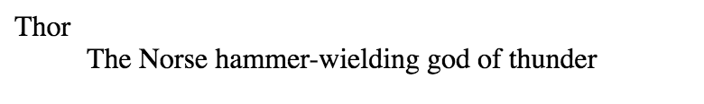
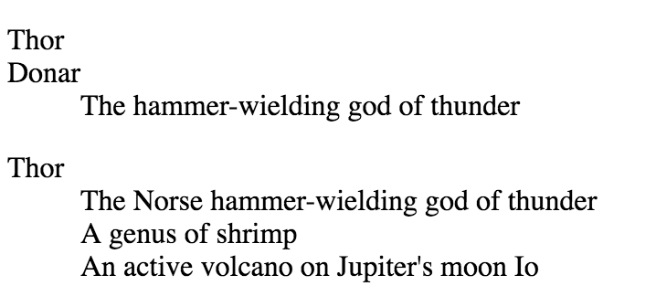
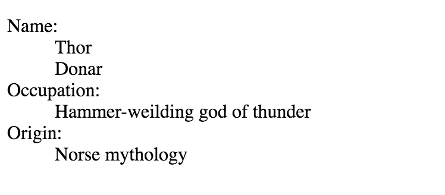

# \<dl\>

*HTML description list element*

The HTML `<dl>` element is used to define a *description list*. The `<dl>` element is used in conjunction with `<dt>` (definition term) and `<dd>` (definition description) tags. Definition lists provide a way to semantically mark up content such as terms and definitions, questions and answers, or any other name-value pairs.


## Syntax

The `<dl>` element must have an opening (`<dl>`) and a closing (`</dl>`) tag

## Example 1 - A basic definition list

At minimum, a description list consists of opening and closing `<dl>` tags surrounding one `<dt>` and `<dd>` pair.

```html
<dl>
	<dt>Thor</dt>
	<dd>The Norse hammer-wielding god of thunder</dd>
</dl>
```
The above code (with default styles) appears in the browser as:




## Example 2 - Using multiple terms and descriptions

Description lists can contain both multiple terms (`<dt>`) associated with single definitions (`<dd`>) *or* multiple definitions associated with a single term.

```html
<!-- multiple terms with single definition -->

<dl>
  <dt>Thor</dt>
  <dt>Donar</dt>
  <dd>The hammer-wielding god of thunder</dd>
</dl>

<!-- single term with multiple definitions -->

<dl>
  <dt>Thor</dt>
  <dd>The Norse hammer-wielding god of thunder</dd>
  <dd>A genus of shrimp</dd>
  <dd>An active volcano on Jupiter's moon Io</dd>
</dl>

```

The above code (with default styles) appears in the browser as:



There should not be more than one `<dt>` tag with the same name in a definition list.  If there are multiple definitions for the same term, list the definitions directly below the term. For example:

```html
<!-- DON'T do this: -->

<dl>
  <dt>Thor</dt>
  <dd>The Norse hammer-wielding god of thunder</dd>
  
  <dt>Thor</dt>
  <dd>A genus of shrimp</dd>
  
  <dt>Thor</dt>
  <dd>An active volcano on Jupiter's moon Io</dd>
</dl>

<!-- do THIS instead: -->

<dl>
  <dt>Thor</dt>
  <dd>The Norse hammer-wielding god of thunder</dd>
  <dd>A genus of shrimp</dd>
  <dd>An active volcano on Jupiter's moon Io</dd>
</dl>
```

## Example 3 - Mixing and matching

You can combine different amount of term and description pairs within the same definition list. This is useful when displaying metadata content:

```html
<dl>
  <dt>Name:</dt>
  <dd>Thor</dd>
  <dd>Donar</dd>
  
  <dt>Occupation:</dt>
  <dd>Hammer-weilding god of thunder</dd>
  
  <dt>Origin:</dt>
  <dd>Norse mythology</dd>
</dl>
```
The above code (with default styles) appears in the browser as:




The "Name" term has two valid definitions which are appropriately listed directly after the `<dt>` element.

## Browser support

|  | Chrome  | Firefox  | Internet Explorer  | Opera  | Safari  |
|---|---|---|---|---|---|
| **Basic support**  | 1.0   | Yes  | Yes  | Yes  | Yes  |

## Special Notes

 - Before HTML5 the `<dl>` tag was defined as a *Definition List*
 - The `<dl>` element should not be used solely to create an indention on a page. It is considered bad practice and obscures the semantic value of the definition list.


