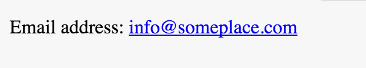

# content

*CSS `content` property*

The `content` CSS property is used with the pseudo elements `:before` and `:after` to generate the content of those elements


## Syntax

Introduction to the syntax/usage. A example of CSS syntax is below:

```css
content: none | normal | <string> | url() | <counter> | attr() | open-quote | close-quote | no-open-quote | no-close-quote | initial | inherit;
```

### Values

#### normal

Giving the `content` property the value of `normal` is the same as giving it the `none` value.

#### none

`none` is the default value of `content` and as you may imagine will cause the pseudo element (:after or :before) not to be rendered.

#### \<string\>

`content` can take the value of any valid string, including an empty string (`content: "";`).

#### url()

`url()` is used to place an external resource into the pseudo element.  Most often used to insert an image.

#### \<counter\>

The `<counter>` value can be used to enter a CSS counter into the pseudo element.

#### attr()

The `attr()` value will render the value of the HTML attribut contained inside the parentheses.

#### open-quote

`open-quote` (along with `close-quote` below) are related to the `quotes` CSS property.  `open-quote` will render the appropriate string from the associated `quotes` property.

#### close-quote

`close-quote` works in the same way as `open-quote` by rendering the appropriate string from the `quotes` property

#### no-open-quote

`no-open-quote` (along with `no-close-quote` are used to adjust the nested levels of the quote property.

#### no-close-quote

`no-open-quote` is used to adjust the level of nesting of quotes. 

## Using a `<string>` value for `content`

We can use a string for the value of `content` for many applications.  A common scenario would be to add some descriptive text to an element such as an email address:

```html
<span class="email">
<a href="mailto:info@someplace.com">info@someplace.com</a>
</span>
```

With the above `mailto:` link we could add a nice descriptive pseudo element in front of the address:

```css
.email:before {
	content: "Email address:"
}
```

And here is the pseudo element's content in the browser:



Giving a pseudo element's `content` property an empty string value is commonly seen when clearing floated elements in a document.

```css
div:after {
	content: "";
	display: table;
	clear: both;
}
```

## Using a url() in `content`

Write a introduction to the example, sufficient to explain what the example is showing.

```html
<h1 class="avatar">Wiggles McFurry </h1>
```

```css
.avatar:after {
  content: url(http://placekitten.com/g/50/50);
}
```

Looks like this in the browser:


## Utilizing `open-quote`, `close-quote`, `no-open-quote`, and `no-close-quote`

Here is an example of the usage of `open-quote`, `close-quote`, `no-open-quote`, and `no-close-quote` values for the `content` property:

```html	
<p>
  <q class="level-1">He said, <q class="level-2">She yelled, <q class="level-3">I’m going to kill you!</q> </q></q>
</p>
```

```css
q {
  quotes: '\0022' '\0022' '\201C' '\201D' '\2018' '\2019';
}

q:before {
  content: open-quote;
}

q:after {
  content: close-quote;
}

.level-3:before {
  content: no-open-quote;
}

.level-3:after {
  content: no-close-quote;
}
```

## Special Notes

Add information that you found that seemed lesser known. Common bugs, obscure bugs, important distinctions, all belong in this section.
