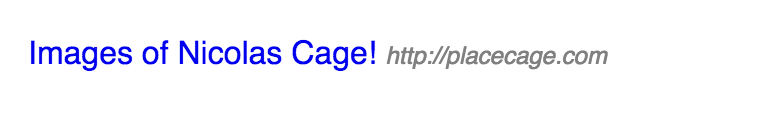
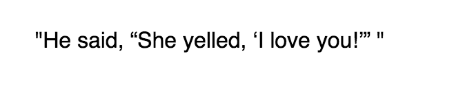
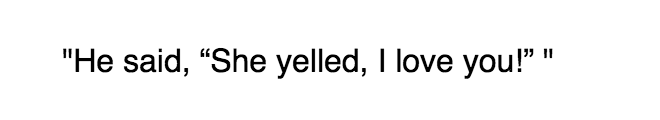

# content

*CSS `content` property*

The `content` CSS property is used with the pseudo elements `:before` and `:after` to insert generated content. The generated content is only rendered in the browser and doesn’t appear in the DOM tree.


## Syntax

```css
content: none | normal | <string> | url() | <counter> | attr() | open-quote | close-quote | no-open-quote | no-close-quote | initial | inherit;
```

## Values

### normal

Giving the `content` property the value of `normal` is the same as giving it the `none` value.

### none

`none` is the default value of `content` and as you may imagine will cause the pseudo element (:after or :before) not to be rendered.

Using `content: normal` or `content: none` could be useful in a case where you have an element that has a pseudo element already defined which you would like to override for some reason.

### \<string\>

`content` can take the value of any valid string, including an empty string (`content: "";`).

##### Using a `<string>` value for `content`

We can use a string for the value of `content` for many applications.  A common scenario would be to add some descriptive text to an element such as an email address:

```html
<span class="email">
<a href="mailto:info@someplace.com">info@someplace.com</a>
</span>
```

With the above `mailto:` link we could add a nice descriptive pseudo element in front of the address:

```css
.email:before {
	content: "Email address:"
}
```

And here is the pseudo element's content in the browser:


Giving a pseudo element's `content` property an empty string value is commonly seen when clearing floated elements in a document.

```css
div:after {
	content: "";
	display: table;
	clear: both;
}
```


### url()

`url()` is used to place an external resource into the pseudo element.  Most often used to insert an image.

##### Using a url() in `content`

```html
<h1 class="avatar">Wiggles McFurry </h1>
```

```css
.avatar:after {
  content: url(http://placekitten.com/g/50/50);
}
```

Looks like this in the browser:


### \<counter\>

The `<counter>` value can be used to enter a CSS counter into the pseudo element.

CSS counters are variables within CSS that allow you adjust the appearance of content based on its placement in the document.

The `content` property can then be used with the value of `<counter>` to display the counter variable's value in the document.

For example with the following mark up:

```html
<section>
<h1>All about movies</h1>
<p>Wow! Who loves movies? Me! I'm going to write about movies now...</p>
</section>

<section>
<h1>Amazing foods</h1>
<p>Oh boy, is there anything better than food? I don't think so...</p>
</section>

<section>
<h1>Pet peeves</h1>
<p>You know what really irks me? Let me tell you...</p>
</section>
```

we can display an order to each `section` element using the `counter` value of the `content` property:

```css
body {
  counter-reset: section;
}

h1:before {
  counter-increment: section;
  content: "Chapter " counter(section) ": ";
  color: #8d8d8d;
}

```
which renders as:


### attr()

The `attr()` value will render the value of the HTML attribute contained inside the parentheses.

Here is an example which appends the url of an `<a>` tag to the element's text:

```html
<a href="http://placecage.com">Images of Nicolas Cage! </a>
```

with this css:

```css
a {
  text-decoration: none;
}
a:after {
  content: attr(href);
  color: gray;
  font-size: 0.75em;
  font-style: italic;
}
```

renders as:




### open-quote

`open-quote` (along with `close-quote` below) are related to the `quotes` CSS property.  `open-quote` will render the appropriate string from the associated `quotes` property.

### close-quote

`close-quote` works in the same way as `open-quote` by rendering the appropriate string from the `quotes` property

### no-open-quote

`no-open-quote` (along with `no-close-quote` are used to adjust the nested levels of the quote property.

### no-close-quote

`no-open-quote` is used to adjust the level of nesting of quotes. 

The following is an example of how one may use `open-quote`, `close-quote`, `no-open-quote`, and `no-close-quote` values for the `content` property.  First let's mark-up a quote that is also quoting someone else:

```html	
<p>
  <q class="level-1">He said, <q class="level-2">She yelled, <q class="level-3">I love you!</q> </q></q>
</p>
```
Now we add the quotes to the `q` tag and display them with the `content` property of the `q:before` and `q:after` pseudo elements:

```css
q {
  quotes: '\0022' '\0022' '\201C' '\201D' '\2018' '\2019';
}

q:before {
  content: open-quote;
}

q:after {
  content: close-quote;
}
```
This is how it looks in the browser:



Now if we wanted to remove the quotation marks surrounding the "I love you!" part of the text we can use the `no-open-close` and `no-close-quote` properties on the nested quote:

```css
q {
  quotes: '\0022' '\0022' '\201C' '\201D' '\2018' '\2019';
}

q:before {
  content: open-quote;
}

q:after {
  content: close-quote;
}

.level-3:before {
  content: no-open-quote;
}

.level-3:after {
  content: no-close-quote;
}
```
Giving us:



## Browser support

| | Chrome  | Firefox  | Internet Explorer  | Opera  | Safari  |
|---|---|---|---|---|---|
| **Basic support** | 1.0   | 1.0 (1.7 or earlier)  | 8.0  | 4.0  | 1.0  |
| **url() support** | 1.0   |1.0 (1.7 or earlier)   | 8.0  | 7.0  | 1.0  |

## Special Notes

When using the `content` property there are some accessiblity concerns. Because the generated content doesn't appear in the DOM tree it may not be completely accessible to assistive devices such as screen readers. It is, however, accessibility supported in most modern browsers, with the exception of Internet Explorer.

Another consideration is the separation of content from presentation.  Generated content shouldn't change the meaning of the original content and should only be used to enhance or supplement the design.