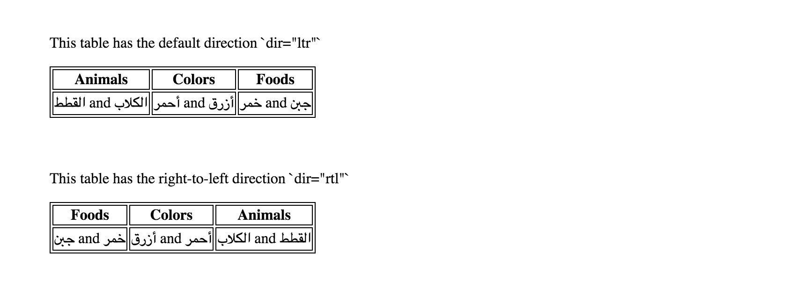

# Dir

*`dir` is a global HTML attribute that is used to specify the text or writing direction of an elements content.*

The `dir` attribute sets the base direction (directional context) for the display of text. This attribute is useful when needing to display markup for languages that read *right-to-left*, such as Hebrew, Arabic, Yiddish and more.  

At a basic level the `dir` attribute can be used to set the text direction at the document level or for elements such as paragraphs, tables and forms.  At a more advanced level the `dir` attribute can be used to handle bidirectional text in which text with different writing directions is mixed within a block element.  This would occur when the markup needs to reflect both English and Hebrew or more specifically text written *left-to-right* and text written *right-to-left*.  

## Browser Support
Overall and breakdown of browser support  

|                   | Chrome | Firefox | Safari | Opera | Edge | IE  |
|:------------------|:------:|:-------:|:------:|:-----:|:----:|:---:|
| Basic Support     |  YES   |   YES   |  YES   |  YES  | YES  | YES |
| Title Support     |  YES   |   YES   |  YES   |  YES  | YES  | NO  |
| Scrollbar Support |  YES   |   YES   |  YES   |  YES  |  NO  | NO  |
| Alertbox Support  |  YES   |   YES   |  YES   |  YES  | YES  | NO  |

#### Additional Information on browser support  
Find more information regarding [browser support ](https://www.w3.org/International/tests/repo/results/native-user-interfaces) for the `dir` attribute  

## Syntax

The `dir` attribute is a global attribute meaning it can be used on any HTML element. The syntax for the `dir` attribute is:  
```
  <element dir=”ltr | rtl | auto”>
```

#### Attributes Values  
*	**ltr** - (default) means left to right is used to set the text directions for languages that are written from left-to-right like the English language  
*	**rtl** – means right to left is used to set the text direction for languages that are written from right-to-left like Hebrew  
*	**auto** – lets the browser set the text direction based on the content of the element.  It parses the characters inside the element, using a basic algorithm, until it finds a character with strong directionality.  

## Example 1 - Basic

A `dir` attribute can be added to the html tag to set the base text direction for the document or page. Each subsequent block element will inherit the text direction of the parent element.  In this example you will notice that RTL languages are read from right to left and are displayed that way.  So the words for the Hebrew language are flipped and read RTL.  When an LTR word or phrase is encountered, the arrangement is switch and read left-to-right, before returning to read right-to-left afterwards.  The exclamation point is considered an RTL character and is thus should come last and aligned to the left. The text direction can also be set on individual block element if the direction of the element needs to be different than the rest of the document.  You will see "My text directions is LTR!" has *left-to-right* directionality.  

HTML:
```
<!DOCTYPE html>
<html dir="rtl" lang="en">
  <head>
    <meta charset="utf-8">
    <title>Right to Left Language</title>
  </head>
  <body>
    <div>
      <p>Hello world!</p>
      <p>שלום עולם!</p>
      <p dir="ltr">My text directions is LTR!</p>
    </div>
  </body>
</html>
```  

RESULT:

*Basic Example of Dir Attribute*

## Example 2 - Dynamic directionality

When the language or the direction of the text is not automatically known `dir=”auto”` can be used for the browser to automatically detect the direction of the content.  

HTML:
```
<div>
  <p dir="auto">I am written in English</p>
  <!--  I am written in Hebrew-->
  <p dir="auto">أنا مكتوبة باللغة العربية </p>
</div>
```  
RESULT:

*Basic Example of dir="auto" Value*

Browser Support for `dir=”auto”`

##Example 3 – Tables
The `dir` attribute can be used to direction of a table element.  In the example below you will see how setting dir=”rtl” will change the flow or order of the columns as well as the content within each cell.  

This examples shows a table with the default direction and the below example shows a table with RTL directionality.  

HTML:
```
<div>
  <p>This table has the default direction `dir="ltr"`</p>
  <table>
    <tr>
      <th>Animals</th>
      <th>Colors</th>
      <th>Foods</th>
    </tr>
    <tr>
      <td>القطط and الكلاب</td>
      <td>أحمر and أزرق</td>
      <td>خمر and جبن</td>
    </tr>
  </table>
</div>

<div>  
  <p>This table has the right-to-left direction `dir="rtl"`</p>
  <table dir="rtl">
    <tr>
      <th>Animals</th>
      <th>Colors</th>
      <th>Foods</th>
    </tr>
    <tr>
      <td>القطط and الكلاب</td>
      <td>أحمر and أزرق</td>
      <td>خمر and جبن</td>
    </tr>
  </table>
</div>
```  
RESULT:

*Example of the dir attribute with tables*

## Example 4 - Complex
There are certain time where you might find the mixing of text direction within the same block element.  This is called bidirectional. The below examples display how to use inline elements to set the direction of a specific word or phrase within a block element. In this case since no direction is set on the `<div>` the direction is set to the default value of “ltr”  

HTML:
```
<div>
  <!--  The YouTube video of a beginner's guide to HTML in hebrew-->
  <p>The YouTube video"<span dir="rtl">למתחילים מדריך<span dir="ltr">HTML </span></span>" in hebrew.</p>
</div>
```

RESULT:

*Complex Example of Dir Attribute with Inline Element*  


## Special Notes

### `Lang` attribute does not set directionality
The `dir` attribute, is commonly used to set the text direction for languages that read *right-to-left*.  And while this attribute is used for languages is it important to note that setting the `lang="en"` or `lang="he"` will not automatically set the base direction for that language.  You need to specify the directionality, which is why the `dir` attribute is so important.  

### Directionality can change the Browser Chrome
The browser chrome should not be confused with the web browser Google Chrome.  The browser chrome is the User Interface of the web browser such as the scrollbar, the title bar, toolbar, status bar, and the window frame.  When directionality is placed on the `html` or `body` tag it can change the browser chrome.  

#### *Title*  

When directionality, of `dir = “rtl”`, is placed on the `html` tag the title element is supposed to inherit the directionality and HTML urges browsers to support this feature.  Unfortunately Internet Explorer does not support this feature, but Edge does. *See above for browser support*.  

#### *Scroll Bar*
When you apply the directionality of RTL, in the html or body tag it will change the position of the scroll bar and place it on the left side instead of the right side.  To prevent this from happening do not apply directionality to html or body tag.  Instead wrap the contents of the page in a `<div>` and apply directionality to that `<div>` or wrapper.  It will affect all block elements inside the body and not affect the browser chrome. *See above for browser support*.  

*Example of a left aligned scrollbar*  

#### *Alert Box*
When directionality, `dir=”rtl”`, is applied to the html tag it will change the directionality of the alert box.  You will see the alert box as a mirror image of it self.  The yellow hazard icon is displayed on the right and the text is displayed from right to left.  To avoid changing the user interface wrap all contents, within the body, in a `<div>` and add directionality to the div. It will affect all block elements inside the body and not affect the browser chrome. *See above for browser support*.  


### Sending directionality to the server
When the browser applies rtl directionality to text in form, by using `dir=”auto”`, that information can be lost when you select submit and send the information to the server.  To avoid this you can use a ne HTML5 attribute `dirname`.
`dirname` allows one to send information to the server so that it can be used and displayed in another context and/or page.
Here's an example of it in use:  
```
<form action="addreview" method="get" dir=”rtl”>
  <label>Review: <input type="text" name="review" dirname="addreviewdir" required></label>
  <button name="submit" type=submit value="add">Add Review</button>
</form>
```

You must enter a value for the dirname and it can be whatever you like. When set, the form passes the direction of the element to the server, using the dirname that was provided. The direction of the form entry field will be submitted in the following format
```
review=myreview&addreviewdir=rtl&submit=add
```
### Use directionality sparingly
Unnecessary use or overuse of the `dir` attribute can make page maintenance more difficult and impact the bandwith.  
If you have provided base direction in the `html` tag you should not use the `dir` attribute on a lower level block element unless you need to change the directionality of that block level element.  Because, using the `dir` attribute can change the browser chrome of some elements it is important the `dir` attribute should not be used on the `html` or `body` tag but instead place the attribute on another high level element and try to eliminate adding the attribute to every block level element unless necessary to change the directionality.
